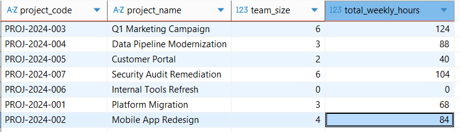

# dbt Project: Project Staffing Analytics

This dbt project provides analytics and data quality checks for project staffing, using HR and project assignment data. Below are step-by-step instructions and documentation for using and understanding the project.

## 1. Project Overview
- Cleans and transforms raw HR and project assignment data.
- Aggregates project staffing: team size, total weekly hours, and active team members per project.
- Ensures data quality with custom tests.

## 2. Setup & Running
1. **Install dependencies**
   - Make sure you have dbt installed and configured for your environment (DuckDB, Postgres, etc.).
   - After installation, run:
     ```bash
     dbt deps
     ```
     To install required dbt packages.
2. **Prepare your data**
   - Place raw Excel exports in `data/raw/`.
   - Run the preprocessing script to convert Excel files to CSV:
     ```bash
     python scripts/preprocess_sources.py
     ```
3. **Run dbt models**
   - Build all models:
     ```bash
     dbt run
     ```
   - Run all tests:
     ```bash
     dbt test
     ```

## Display available commands
You can use the following Makefile commands:

```
make preprocess   # Process raw Excel files into CSVs
make load         # Load processed CSVs into DuckDB raw schema
```

To see this list in your terminal, run:
```
make help
```

## 3. Data Flow
- **Staging models**: Clean and standardize raw data (`stg_hr_employees`, `stg_project_assignments`).
- **Intermediate models**: Join HR and assignment data, add business logic flags (`int_project_assignments_joined`).
- **Marts models**: Aggregate staffing metrics per project (`project_staffing`).

## 4. Key Models
- `project_staffing`: Shows all projects, counts only active employees, sums their weekly hours, and lists active team members. Projects with no active employees are still included.
- `int_project_assignments_joined`: Joins assignments with HR data, flags valid assignments and active employees.

## 5. Data Quality & Tests
- Custom dbt tests check:
  - No assignments for inactive employees.
  - Employees with no termination date must be marked as active.
  - Unique combinations of project code and name.
  - Team size is always zero or positive.

## 6. Documentation
- All models and columns are documented in their respective `schema.yml` files.
- Column descriptions and business logic are provided for clarity and maintainability.

## Input Data
The main input file for HR data is `data/processed/hr_employees.csv`. Below are the columns and their meanings:

| Column            | Description                                                        |
|-------------------|--------------------------------------------------------------------|
| employee_id       | Unique identifier for the employee from the HR system              |
| first_name        | Employee's first name                                              |
| last_name         | Employee's last name                                               |
| email_address     | Employee's email address                                           |
| department        | Department where the employee works                                |
| job_title         | Employee's job title                                               |
| date_of_hire      | Date when the employee was hired                                   |
| termination_date  | Date when the employee left the company (empty if still employed)  |
| status            | Employment status: Active or Inactive                              |
| reports_to        | Employee ID of the manager to whom the employee reports            |

The main input file for project assignments is `data/processed/project_assignments.csv`. Below are the columns and their meanings:

| Column          | Description                                                        |
|-----------------|--------------------------------------------------------------------|
| assignment_id   | Unique identifier for the project assignment                       |
| emp_id          | Employee ID assigned to the project                                |
| project_code    | Unique code identifying the project                                |
| project_name    | Name of the project                                                |
| assignment_role | Role of the employee in the project                                |
| start_date      | Date when the assignment started                                   |
| weekly_hours    | Number of hours assigned per week to the project                   |
| billable        | Indicates if the assignment is billable (Y/Yes/N/No)               |

These columns are used to clean, transform, and analyze project assignment data in the dbt project.

## 7. Resources
- Learn more about dbt [in the docs](https://docs.getdbt.com/docs/introduction)
- Check out [Discourse](https://discourse.getdbt.com/) for commonly asked questions and answers
- Join the [chat](https://community.getdbt.com/) on Slack for live discussions and support
- Find [dbt events](https://events.getdbt.com) near you
- Check out [the blog](https://blog.getdbt.com/) for the latest news on dbt's development and best practices

## Final Result
After running all steps, you can query the final table `project_staffing` for aggregated staffing metrics. Example:

```sql
SELECT * FROM project_staffing;
```

Example output:


